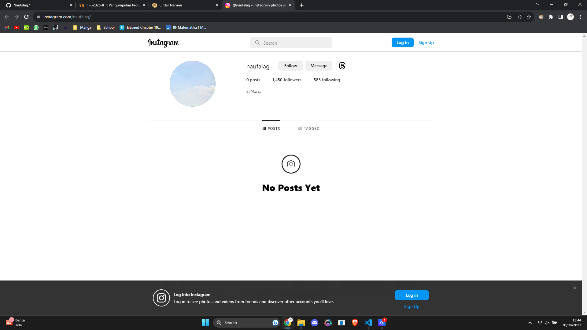

# Ayam Narumi.
Belajar membuat website, dengan tema berjualan ayam yang mungkin akan dipake kedepannya.

## Website preview

### Home

### Profile

### Ayam Goreng

### Ayam Kuning

### Mitra

### Alamat

### Instagram

### Whatsapp

### Maps

Untuk maps, merupakan link yang akan dibuka pada saat mengklik gambar peta pada halaman alamat.
